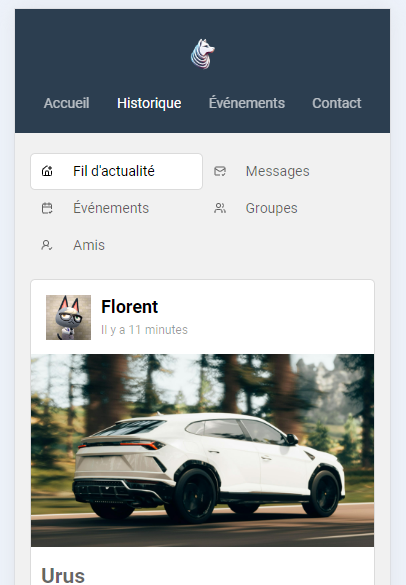
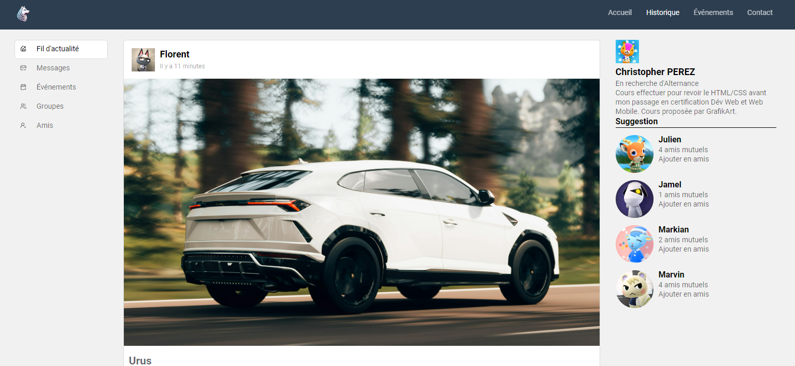

# :octocat: Projet | Réseau Social

Ce projet à été réalisé dans le cadre d'une formation de <a href = 'https://grafikart.fr/tutoriels/tp-reseau-social-1051' target = '_blank'>Grafikart</a> afin d'approfondir les bases du HTML et du CSS.

## Fonctionnalités

- **Page d'Accueil :** Présente le fil d'actualité avec plusieurs publications, chaque publication comprenant une image, une date de publication, un titre et un contenu.
- **Barres Latérales :** La première barre latérale permet de naviguer facilement entre le fil d'actualité, les messages, les événements, les groupes et les amis. La deuxième barre latérale propose des suggestions d'amis basées sur les connexions mutuelles.
- **Design Moderne :** Une mise en page élégante et moderne avec des sections bien définies.
- **Responsive :** Compatible avec différents appareils pour une expérience utilisateur optimale en mobile first.


### Technologies Utilisées


#### Mon Projet

Ce projet fut le troisième réalisé grâce à Grafikart. Il m'a permis d'approfondir les bases en HTML & CSS. J'ai laisser cours a ma fantasie pour l'améliorer.

##### Comment Exécuter le Projet Localement

1. Clonez ce référentiel sur votre machine locale :
   ```bash
   git clone https://github.com/votre-utilisateur/votre-repository.git
   ```
2. Accédez au dossier du projet :
   ```bash
   cd votre-repository
   ```
3. Ouvrez le fichier `index.html` dans votre navigateur pour voir le site.





